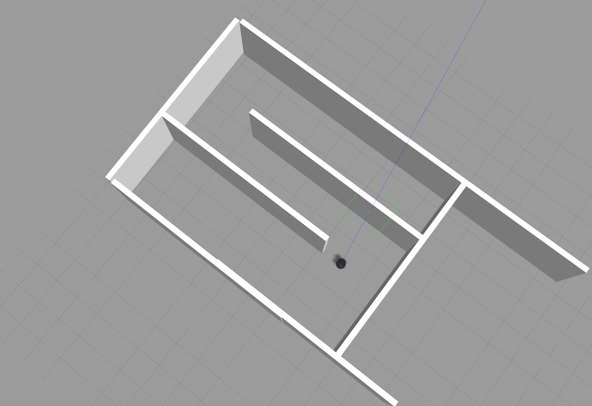

# Udacity Project "Home Service Robot"

## Workspace Docker Container
There is a problem installing dependencies for ROS Noetic, so downgrading to ROS Kinetic.
In a docker container (see docker.Dockerfile, `docker build -t roomba .`), initialise the workspace as explained below.

```
mkdir -p ~/project_five/src
cd ~/project_five/src
catkin_init_workspace
cd ..
catkin_make
```

```
sudo apt update
cd ~/project_five/src
git clone https://github.com/ros-perception/slam_gmapping
git clone https://github.com/turtlebot/turtlebot
git clone https://github.com/turtlebot/turtlebot_interactions
git clone https://github.com/turtlebot/turtlebot_simulator
cd ~/project_five/
source devel/setup.bash
rosdep update --include-eol-distros
rosdep install --from-paths src -r -y

catkin_make
source devel/setup.bash
```

upgrade gazebo from 7 to 9
```
# add sources
# add keys
# sudo apt-get remove ros-kinetic-gazebo*
sudo apt-get install ros-kinetic-gazebo9-ros-pkgs ros-kinetic-gazebo9-ros-control ros-kinetic-gazebo9*

```

```
# install a few more dependencies
rosdep -i install gmapping
rosdep -i install turtlebot_teleop
rosdep -i install turtlebot_rviz_launchers
rosdep -i install turtlebot_gazebo
``` 

## Launching Turtlebot world

Using the corridor world that comes with `turtlebot_simulator`.  To open `xterm` with a default font and size: `xterm -fa 'Monospace' -fs 14`. Testing SLAM in the `turtlebot_simulation/corridor_world`:


* `roslaunch turtlebot_gazebo turtlebot_world.launch world_file:=$(rospack find turtlebot_gazebo)/worlds/corridor.world`
* `roslaunch turtlebot_gazebo gmapping_demo.launch`
* `roslaunch turtlebot_rviz_launchers view_navigation.launch`


## Gazebo
trying to update gazebo from 7 to 9 in the docker file
in the dockerfile
``` 
# update public key for gazebo
ENV APT_KEY_DONT_WARN_ON_DANGEROUS_USAGE=DontWarn 
RUN sudo sh -c 'echo "deb http://packages.osrfoundation.org/gazebo/ubuntu-stable `lsb_release -cs` main" > /etc/apt/sources.list.d/gazebo-stable.list'
RUN curl --insecure https://packages.osrfoundation.org/gazebo.key | sudo apt-key add -

RUN sudo apt-get remove ros-kinetic-gazebo* -y

RUN apt-get update && apt-get install -y \
ros-kinetic-gazebo9-ros-pkgs \
ros-kinetic-gazebo9-ros-control ros-kinetic-gazebo9* 

```