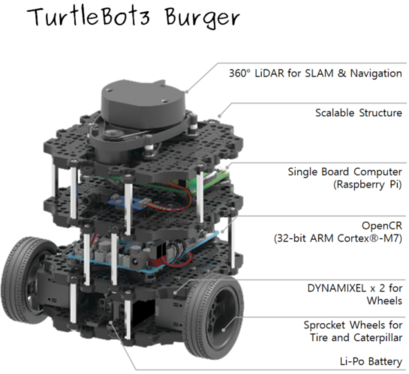
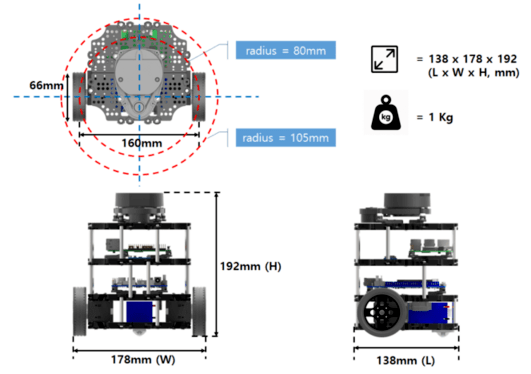
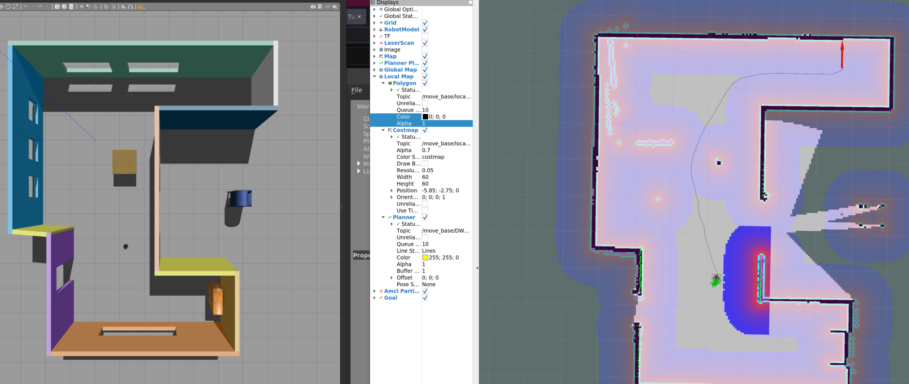
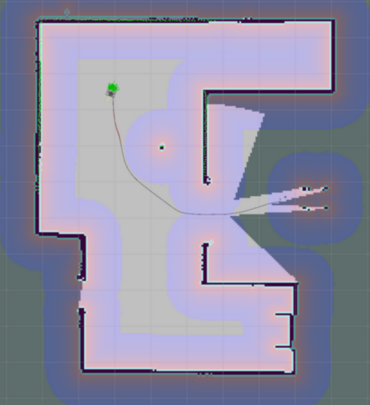
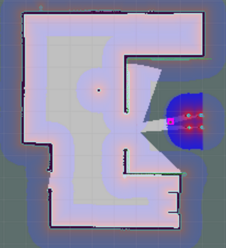

# Udacity Project "Home Service Robot"

## Workspace Docker Container
There is a problem installing dependencies for the Turtlebot packages in ROS Noetic, so I tried to create a docker container with ROS kinetic, and access to an nvidia gpu and Gazebo (9 or 7). However none of that worked seemlessly, on the udactiy workspace there were expired signatures and in the docker container I couldn't get the realsense dependency installed.  

### TurtleBot3
So instead I am using turtlebot3 and Noetic, ensuring compatibility with the Ros navigation stack `openslam gmapping`. 

The model used for the robot is Robotis' [TurtleBot 3 Burger](https://emanual.robotis.com/docs/en/platform/turtlebot3/features/#data-of-turtlebot3-burger). The components and a schematic of the robot is shown below.


  

The `turtlebot3.Dockerfile` details the configuration of a docker container which runs ROS Noetic with the ROS navigation stack (explained in more detail below) and all the dependencies required for the Turtlebot3 model.  Build with `docker build -t noetic-tbot3 -f turtlebot3.Dockerfile . `, which you can then start with `./home_service_robot.sh -i noetic-tbot3`.   The Turtlebot3 model and Gazebo simulation packages have been added to the src dir of this repository as submodules, notice the `noetic-devel` branches are checked out.

```
cd src
git clone -b noetic-devel https://github.com/ROBOTIS-GIT/turtlebot3
git clone -b noetic-devel https://github.com/ROBOTIS-GIT/turtlebot3_simulations
cd ..
catkin_make
```
Test launch with 
```
export TURTLEBOT3_MODEL=burger  # this is set in the Dockerfile
roslaunch turtlebot3_gazebo turtlebot3_world.launch
```

More information available from:
* https://emanual.robotis.com/docs/en/platform/turtlebot3/simulation/
* https://www.youtube.com/watch?v=ji2kQXgCjeM


### World File
Using the basic ground floor world create for earlier tutorials, with some extra features added from the repo of [gazebo models](https://github.com/osrf/gazebo_models).  These are stored in the  `src/turtlebot3/turtlebot3_gazebo/` `launch`, `models` and `worlds` directories.

```
sudo apt update
cd ~/project_five/src
git clone https://github.com/ros-perception/slam_gmapping
git clone https://github.com/turtlebot/turtlebot
git clone https://github.com/turtlebot/turtlebot_interactions
git clone https://github.com/turtlebot/turtlebot_simulator
```
The `rosdep` package manager tries to install packages that are part of turtlebot which we do not need, so instead of automatically discovering the dependencies, run the following:
```
sudo rosdep init
rosdep update --include-eol-distros
rosdep install --from-paths src -y -r
```
Only install the necessary components with the following:
```
# install a few more dependencies
rosdep -i install gmapping
rosdep -i install turtlebot_teleop
rosdep -i install turtlebot_rviz_launchers
rosdep -i install turtlebot_gazebo
``` 
The change to the project workspace `project_five` and run `catkin_make`, then `source devel\setup.bash` etc.

## Packages Used for the Project

As shown in the `turtlebot3.Dockerfile` the ROS navigation stack used in this project includes the following packages:
* [ros-noetic-gmapping](http://wiki.ros.org/gmapping)
* [ros-noetic-amcl](http://wiki.ros.org/amcl)
* [ros-noetic-map-server](http://wiki.ros.org/map_server)
* [ros-noetic-navigation](http://wiki.ros.org/navigation)
* [ros-noetic-move-base](http://wiki.ros.org/move_base)

ROS gmapping is a wrapper for [OpenSlam's Gmapping](https://openslam-org.github.io/gmapping.html) which uses a particle filter to keep track of likely positions of the robot and build maps based on laser range data and the parts of the map that have already been built.  

These maps are stored as images, which represent the world as a 2D grid where white is open space and black is occupied. Each map has an associated `yaml` file which defines the image file name, resolution, origin, etc.  These files are stored in the `src/home_service_world/maps` folder, specifically `single_room.yaml` for the simplified world which is used for the final section of home service project.

In order to use this map, we need to use the map-server to save a map file: `$ rosrun map_server map_saver -f ~/src/maps`.   When using the map for localisation we need to load the map into the mapserver using the launch file `\src\home_service_world\turtlebot3_navigation_launch` with as follows:  `<node pkg="map_server" name="map_server" type="map_server" args="$(arg map_file)"/>`.  Then we can use ROS AMCL with the map for localisation.

ROS Navigation is a stack of packages used for navigation, i.e. taking sensor inputs (odometry, range sensor data, and goal pose), integrating this with the map and then it outputs safe velocity commands that are sent to a mobile base.  The stack includes a global planner which uses a path planning algorithm to plan the shortest route from the current location to the goal. The nav stack creates a global costmap which shows how good it is to be in a particular location, e.g. collision with known obstacles or walls have a higher cost than open space.

The local planner takes this path and then attempts to drive the robot along it, using information from the sensors to avoid obstacles, including those which are not on the map.  The local planner also constracts a local cost map where low cost, good places to move are shown as cold colours, and bad places such as walls are shown as hot colors. 


ROS move_base is the package that provides the implementation of an action, it links together the global and local planner to accomplish the goal.  When the robot gets close to the goal pose, the action terminates.

Good navigation relies on good localisation so the initial pose estimate is important for this task. It is possible to update the initial pose estimate by publishing a pose with covariance to the `/initial_pose` topic.  Even if the initial estimate is inaccurate, over time as the robot moves around, the pose estimate improves as the candidate particles in the amcl node converge onto the actual position.


## Slam Testing with Turtlebot3

To open `xterm` with a default font and size: `xterm -fa 'Monospace' -fs 14`. The custom world created for previous projects is quite large, so mapping the whole space takes quite a while.  The screen shot below is taken in the early stages. 

Added to the `.bashrc` to source the necessary files for opening terminals.


* `roslaunch home_service_world turtlebot3_ground_floor.launch `
* `roslaunch turtlebot3_slam turtlebot3_slam.launch slam_methods:=gmapping` this also opens a rviz window.
* `roslaunch turtebot3_teleop turtlebot3_teleop_key.launch`

Instead of creating a script file to open multiple `xterm` terminals, `test_slam.sh` is a script which  sources the ROS setup files and then opens the individual tmux panes all within a docker container.  the screen shot aboves shows SLAM running.


`$ rosrun map_server map_saver -f ~/map` to save a 2-D occupancy grid map to be used for navigation.

##  Localisation and Navigation testing

I created a smaller room for the remainder of the exercise as it is quicker and simpler to move the robot around the space to test navigation and mapping.  Launch AMCL with `home_service_world` launch file `turtlbot3_navigation.launch` which sets the default map appropriately.  The script file `test_local_nav.sh` sets up a tmux session with all the required windows. Once launched, provide a pose estimate of the robot in RViz to align the various maps.  Then add a Nav goal and check that the robot can successfully navigate to the goal.

[Move Base documentation](http://wiki.ros.org/move_base)




Instead of using the 'pose estimate' GUI in Rviz by clicking on the map, we can publish an `/amcl_pose`,  [`PoseWithCovarianceStamped`](http://docs.ros.org/en/noetic/api/geometry_msgs/html/msg/PoseWithCovarianceStamped.html) message type with nested field names, as shown below.  Run `rosrun pick_objects send_initial_pose` to achieve this programmatically.

```
header: 
  seq: 1
  stamp: 
    secs: 488
    nsecs: 755000000
  frame_id: "map"
pose: 
  pose: 
    position: 
      x: -3.0872881153697405
      y: 0.9393199272314398
      z: 0.0
    orientation: 
      x: 0.0
      y: 0.0
      z: 0.0016080547786019668
      w: 0.9999987070790787
  covariance: [0.18049562705798472, 0.039020922753583154, 0.0, 0.0, 0.0, 0.0, 0.039020922753583154, 0.14936524100517112, 0.0, 0.0, 0.0, 0.0, 0.0, 0.0, 0.0, 0.0, 0.0, 0.0, 0.0, 0.0, 0.0, 0.0, 0.0, 0.0, 0.0, 0.0, 0.0, 0.0, 0.0, 0.0, 0.0, 0.0, 0.0, 0.0, 0.0, 0.05703697943547713]

```

```
rostopic pub /initialpose geometry_msgs/PoseWithCovarianceStamped "{ header: { frame_id: "/map" }, pose: {pose: {position: {x: -3 , y: 1 , z: 0 } , orientation: {x: 0 , y:0 , z:0 ,w:0} } } }"
```


## Reaching Multiple Goals
Programmed an executable, `multiple_navigation_goals.cpp` to move from one pickup location in the top right corner, to a drop-off location in the bottom right corner.  
`rosrun pick_objects pick_objects`


## Virtual Objects
Following [Ros Marker documentation](http://wiki.ros.org/rviz/Tutorials/Markers%3A%20Basic%20Shapes) to use markers for visualisation in RViz, `rosrun add_markers single_marker`. If markers don't load in RViz, then add them and save the RViz config file.  

Instead of keeping track of odometry and comparing current `amcl_pose` messages with anticipated goal locations, we can keep track of pickup objects by using an auto-generated `goal_id` for each goal, and subscribe to the `/move_base/result`, `/move_base/current_goal` [Message Type: geometry_msgs/PoseStamped] or `/move_base/status` [Message Type: actionlib_msgs/GoalStatusArray] topics. These topics only change when a new goal is acceepted by the action server or reached. We can also get the location of the marker from the current goal message instead of using another hardcoded goal location and we can check the status field of the results topic to establish whether the robot has reached the goal, and then delete the marker.  

The status can be decoded, see [GoalStatus message definition](http://docs.ros.org/en/noetic/api/actionlib_msgs/html/msg/GoalStatus.html).
* `/move_base/current_goal -> pose.position.x, pose.position.y ... ` : just the position and orientation, no goal id.
* `/move_base/status -> status_list.status: 1` : goal accepted by action server
* `move_base/status -> status_list.goal_id.id` : "/multiple_navigation_goals-1-(secs).(nsecs)" - auto-generated so not really useful in this case
* `/move_base/status -> status_list.status: 3` : goal reached 

For this predefined case I implemented a simple solution by encoding the logic of which marker to display in the goal status and current goal call back functions in `add_markers.cpp`.   

>**Script file `/scripts/home_service.sh` opens all the required terminals and runs the nodes to move the turtlebot robot to the pickup location and then to the drop off location.**  The series of screen-shots below show:
* the turtlebot moving to the pickup location (blue circle marker shown en route)
* robot arriving at the pickup location, followed by 5s pause to simulate pickup
* robot moving to the dropoff location (pickup marker deleted)
* robot arrived at the drop off location outside the house (pink square marker), next to the post box.  

There are two terminal screen shots which show the relevant ROS_INFO output.

 
 
 


