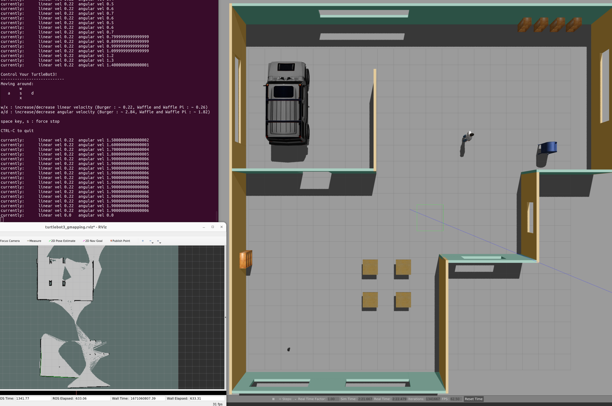

# Udacity Project "Home Service Robot"

## Workspace Docker Container
There is a problem installing dependencies for the Turtlebot packages in ROS Noetic, so I tried to create a docker container with ROS kinetic, and access to an nvidia gpu and Gazebo (9 or 7). However none of that worked seemlessly, on the udactiy workspace there were expired signatures and in the docker container I couldn't get the realsense dependency installed.  

### TurtleBot3
So instead I am using turtlebot3 and Noetic, ensuring compatibility with `openslam gmapping`.  Added to the `.bashrc` to source the necessary files for opening terminals.  See `turtlebot3.Dockerfile`, build with `docker build -t noetic-tbot3 -f turtlebot3.Dockerfile . `, which you can then start with `./home_service_robot.sh -i noetic-tbot3`.   The following git repositories have been added to the src dir as submodules.

```
cd src
git clone -b noetic-devel https://github.com/ROBOTIS-GIT/turtlebot3
git clone -b noetic-devel https://github.com/ROBOTIS-GIT/turtlebot3_simulations
cd ..
catkin_make
```
Test launch with 
```
export TURTLEBOT3_MODEL=burger  # this is set in the Dockerfile
roslaunch turtlebot3_gazebo turtlebot3_world.launch
```

More information available from:
* https://emanual.robotis.com/docs/en/platform/turtlebot3/simulation/
* https://www.youtube.com/watch?v=ji2kQXgCjeM


```
mkdir -p ~/project_five/src
cd ~/project_five/src
catkin_init_workspace
cd ..
catkin_make
```

### World File
Using the basic ground floor world create for earlier tutorials, with some extra features added from the repo of [gazebo models](https://github.com/osrf/gazebo_models).  These are stored in the  `src/turtlebot3/turtlebot3_gazebo/` `launch`, `models` and `worlds` directories.

```
sudo apt update
cd ~/project_five/src
git clone https://github.com/ros-perception/slam_gmapping
git clone https://github.com/turtlebot/turtlebot
git clone https://github.com/turtlebot/turtlebot_interactions
git clone https://github.com/turtlebot/turtlebot_simulator

```
The `rosdep` package manager tries to install packages that are part of turtlebot which we do not need, so instead of running the following:
```
sudo rosdep init
rosdep update --include-eol-distros
rosdep install --from-paths src -y -r
```
Only install the necessary components with the following:
```
# install a few more dependencies
rosdep -i install gmapping
rosdep -i install turtlebot_teleop
rosdep -i install turtlebot_rviz_launchers
rosdep -i install turtlebot_gazebo
``` 
The change to the project workspace `project_five` and run `catkin_make`, then`source devel\setup.bash` etc.

## Slam Testing with Turtlebot3

To open `xterm` with a default font and size: `xterm -fa 'Monospace' -fs 14`. The custom world created for previous projects is quite large, so mapping the whole space takes quite a while.  The screen shot below is taken in the early stages. 

Added to the `.bashrc` to source the necessary files for opening terminals.



* `roslaunch home_service_world turtlebot3_ground_floor.launch `
* `roslaunch turtlebot3_slam turtlebot3_slam.launch slam_methods:=gmapping` this also opens a rviz window.
* `roslaunch turtebot3_teleop turtlebot3_teleop_key.launch`

Instead of creating a script file to open multiple `xterm` terminals, `test_slam.sh` is a script which  sources the ROS setup files and then opens the individual tmux panes all within a docker container.  the screen shot aboves shows SLAM running.


`$ rosrun map_server map_saver -f ~/map` to save a 2-D occupancy grid map to be used for navigation.

##  Localisation and Navigation testing

I created a smaller room for the remainder of the exercise as it is quicker and simpler to move the robot around the space to test navigation and mapping.  Launch AMCL with `home_service_world` launch file `turtlbot3_navigation.launch` which sets the default map appropriately.  The script file `test_local_nav.sh` sets up a tmux session with all the required windows. Once launched, provide a pose estimate of the robot in RViz to align the various maps.  Then add a Nav goal and check that the robot can successfully navigate to the goal.


