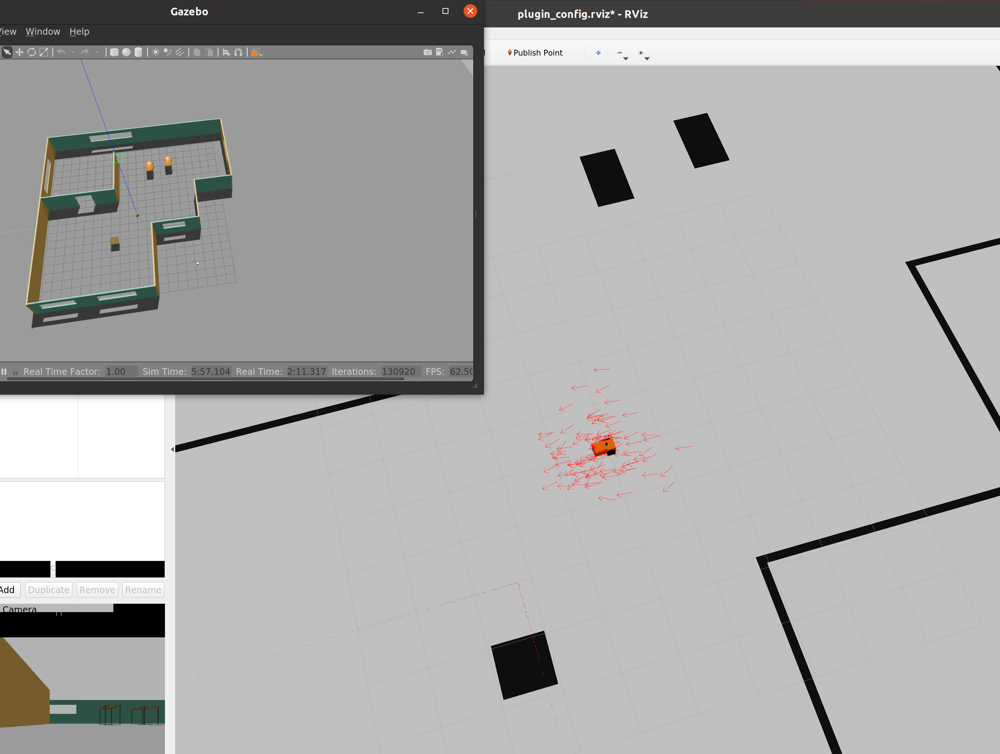
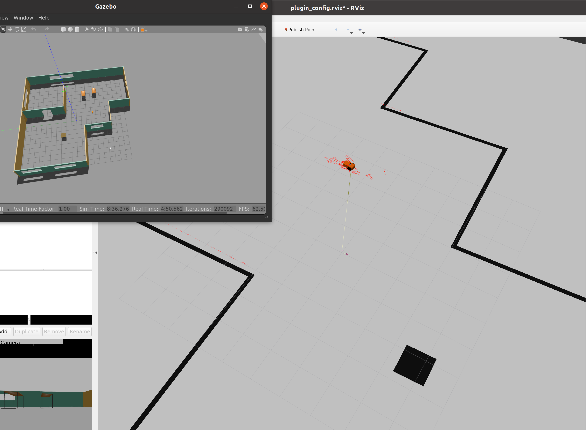

# Udacity Project "Map My World"

Added `ros-noetic-rtabmap` and `ros-noetic-rtabmap_ros` to the docker image.

Open the following terminals, source each one first with `source devel/setup.bash`.
* Launch the world and the robot description:
`roslaunch simple_chassis_bot world.launch`
* Launch the tele-op controller, [teleop_twist_keyboard](https://github.com/ros-teleop/teleop_twist_keyboard):
`rosrun teleop_twist_keyboard teleop_twist_keyboard.py`
* 

## Screenshots of localisation
* first screen shot taken before any localisation, 
* second sheet a short while later after moving around, 