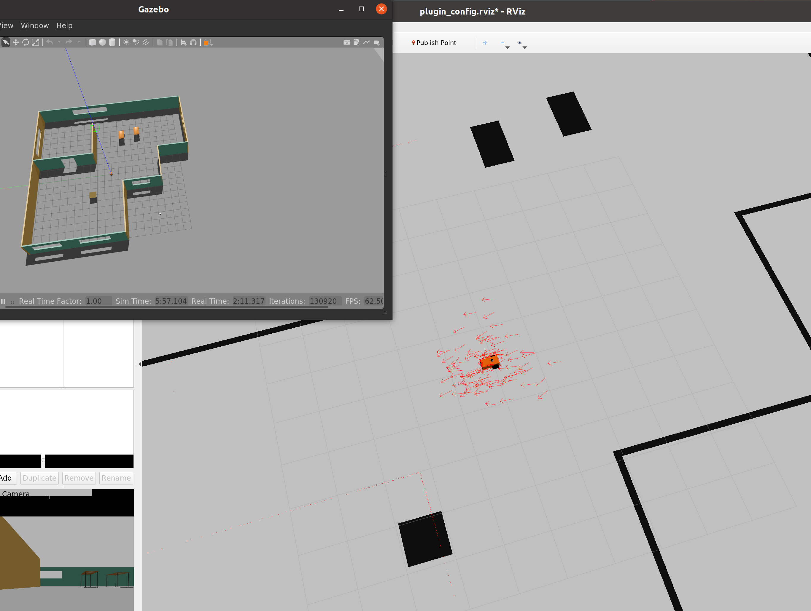

# Udacity Project "Where am I"

`roslaunch simple_chassis_bot world.launch`
## Screenshots of localisation
* first screen shot taken before any localisation, 
* second sheet a short while later after moving around, 